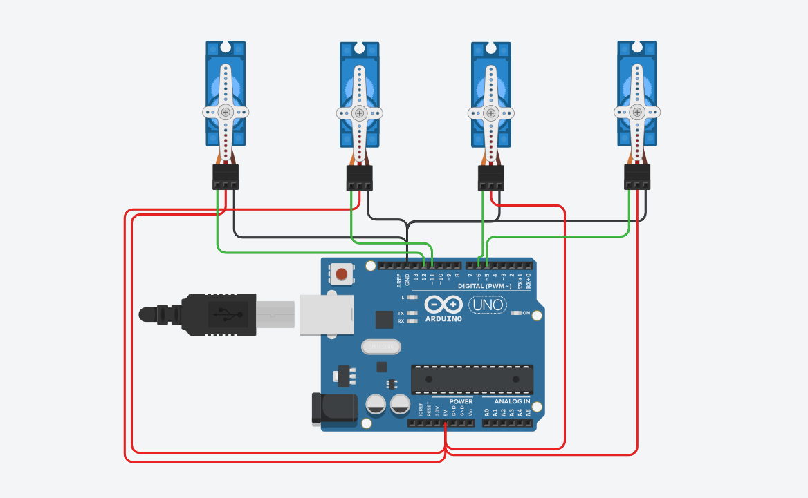

# ServoSweep-WalkControl

## Overview

This project demonstrates the control of four servo motors using an Arduino Uno to perform a sweeping motion from 0° to 180° and back to 0°, simulating a walking pattern. Each servo motor operates sequentially with a 1-second delay between each to create a staggered movement effect.

## Components Used

- Arduino Uno
- 4 x Standard Servo Motors
- Jumper Wires

## Circuit Diagram

## Connections

- Servo 1: Signal → D3
- Servo 2: Signal → D5
- Servo 3: Signal → D6
- Servo 4: Signal → D9

## Code Explanation

The Arduino sketch `servo_sweep_control.ino` implements the following sequence:

1. Each servo motor sweeps from 0° to 180°.
2. After reaching 180°, the servo returns to 0°.
3. A 1-second delay is introduced between each servo's movement to create a staggered effect.

## Usage

Upload the `servo_sweep_control.ino` sketch to your Arduino Uno. Ensure that the servo motors are connected as per the connections listed above. Upon powering the Arduino, the servo motors will begin their sweeping motion sequentially.

## License

This project is licensed under the MIT License - see the [LICENSE](LICENSE) file for details.
